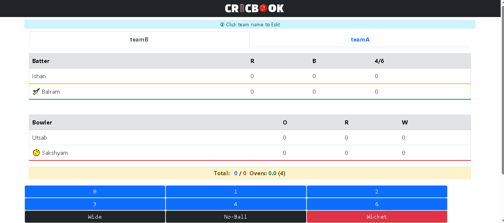

Project Title

Cricbook:
Cricook is a web-based that helps us to store data of a cricket match.

Description:
It is a website which have facility to put players name, team name and there are given buttons which we can click according to what happened in the delievered ball.When i was playing cricket i noticed a major problem, in the small areas where we play cricket there are not big facilities and we always forgot the match scores and suddenly i got idea to build this

Screenshot:

Getting Started:

Dependencies:
Modern Browser, OS
Example: Chrome,Brave,EDGE and Windows, linux, and macos.

Installing:

You can clone the file from  github repository.
If you think this website needs any modifiication than you are allowed to modify the project.

Helps:

If you cant selecct the bowler,batsman than check your  browser or if the browser is modern than try refershing.

License:
The project is Licensed under thhe MIT License-see the License file for details.